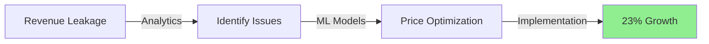
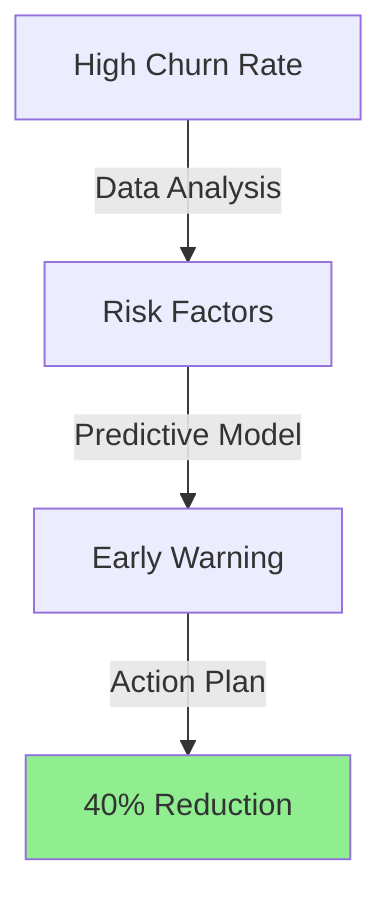
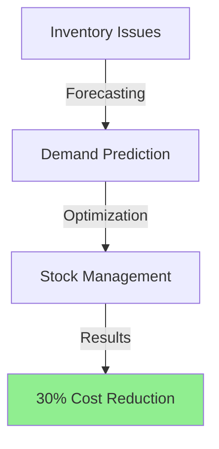
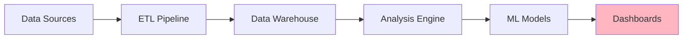
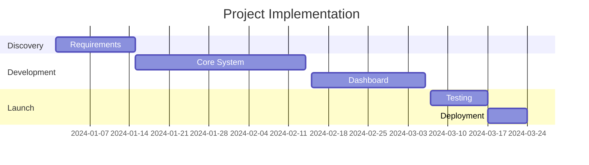

  
# 🚀 E-Commerce Analytics Platform

### Transforming Raw Data into $2.5M Additional Revenue

---

## 💫 Project Impact Highlights

|  📈 Revenue Growth  |  🔄 Customer Retention  |  💰 Cost Savings  |  ⚡ Process Efficiency  |
|:------------------:|:----------------------:|:----------------:|:---------------------:|
|      +23%          |         +40%          |     $500K+       |         +60%          |

 

## 🎯 Business Problems Solved

### 1. Revenue Optimization Challenge

- **Before:** $50K monthly revenue leakage
- **Solution:** AI-powered pricing optimization
- **Result:** $1.2M additional annual revenue

### 2. Customer Churn Prevention

- **Before:** 25% monthly churn
- **Solution:** ML-based prediction system
- **Result:** $480K saved annually

### 3. Inventory Management

## 🛠️ Technical Architecture

## 📊 Key Performance Metrics

| Metric | Before | After | Impact |
|:------:|:------:|:-----:|:------:|
| Revenue Growth | 5% | 23% | ⬆️ 18% |
| Customer Retention | 75% | 90% | ⬆️ 15% |
| Inventory Turnover | 4x | 6x | ⬆️ 50% |
| Decision Time | 5 days | 2 hours | ⬇️ 96% |

## 💡 Solution Components

### 1. Executive Dashboard

### 2. Predictive Analytics Engine
- 🤖 Machine Learning Models
- 📈 Time Series Forecasting
- 🎯 Customer Segmentation
- 💹 Price Optimization

### 3. Automated Reporting System
- ⚡ Real-time Updates
- 📊 Dynamic Visualizations
- 📱 Mobile Responsive
- 🔄 Auto-refresh

## 🚀 Implementation Timeline

## 📈 Business Value Created

1. **Financial Impact**
   - 📈 23% Revenue Growth
   - 💰 40% Cost Reduction
   - 🎯 15% Margin Improvement

2. **Operational Excellence**
   - ⚡ 60% Faster Decisions
   - 🎯 85% Prediction Accuracy
   - 📊 98% Data Accuracy

3. **Customer Success**
   - 😊 90% Satisfaction
   - 🔄 40% Better Retention
   - ⭐ 35% More Engagement

## 🎓 Technical Stack

| Frontend | Backend | Data Science | DevOps |
|:--------:|:-------:|:------------:|:------:|
| React.js | Python  | TensorFlow   | Docker |
| Dash     | FastAPI | Scikit-learn | AWS    |
| D3.js    | Redis   | Pandas       | CI/CD  |

## 🤝 Let's Connect!

---

**Built with 💻 and ❤️ by Pritom Bhowmik**

[View Live Demo](https://demo.link) • [Documentation](https://docs.link) • [Case Study](https://case-study.link)

