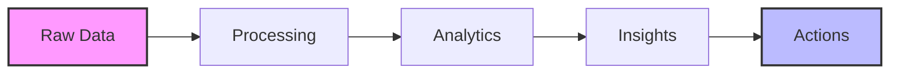

# 📊 E-Commerce 360: Smart Analytics & Insights Platform

> Transform your e-commerce data into actionable insights with comprehensive analytics, stunning visualizations, and strategic recommendations.

## 🌟 What Makes Us Special

Our platform combines powerful analytics with beautiful visualizations to help you:
- 📈 Optimize revenue and profitability through smart pricing
- 👥 Understand and segment customers for personalized experiences
- 📦 Manage inventory efficiently with AI-powered forecasting
- 🎯 Track and improve marketing campaign performance
- 🔄 Stay ahead of market trends and competition

## 🎯 Key Features

### Revenue Intelligence
- Real-time revenue tracking and analysis
- Dynamic pricing optimization
- Profit margin analytics
- Discount impact assessment

### Customer Analytics
- Advanced segmentation
- Lifetime value prediction
- Churn risk analysis
- Purchase pattern recognition

### Inventory & Supply Chain
- Smart stock level management
- Demand forecasting
- Supplier performance metrics
- Reorder point optimization

### Marketing & Growth
- Campaign ROI tracking
- A/B testing analytics
- Customer journey mapping
- Attribution modeling

## 📊 Sample Visualizations

Our platform offers rich, interactive visualizations including:



## 🔧 Technical Architecture

```
E-Commerce360/
├── 📊 dashboards/       # Interactive visualization apps
├── 📁 data/            # Data management
├── 📓 notebooks/       # Analysis workbooks
├── 📑 reports/         # Business insights
└── 🛠️ utils/           # Helper functions
```

## 💻 Quick Start

### Prerequisites
- Python 3.8+
- Git
- Virtual environment (recommended)

### Installation

```bash
# Clone the repository
git clone https://github.com/yourusername/E-Commerce360.git

# Navigate to project directory
cd E-Commerce360

# Create and activate virtual environment
python -m venv venv
source venv/bin/activate  # Unix/macOS
# or
venv\Scripts\activate     # Windows

# Install dependencies
pip install -r requirements.txt
```

## 📊 Dashboard Preview

Launch the interactive dashboard:
```bash
python dashboards/app.py
```

Features include:
- 📈 Real-time metrics tracking
- 🎨 Customizable visualizations
- 📱 Mobile-responsive design
- 🔄 Auto-refreshing data
- 📤 Export capabilities

## 🔍 Data Sources

Our platform integrates multiple data sources:

| Dataset | Description | Update Frequency |
|---------|-------------|------------------|
| Transactions | Purchase history & metrics | Real-time |
| Customers | Demographics & behavior | Daily |
| Products | Catalog & inventory | Hourly |
| Market Trends | Industry insights | Weekly |
| Competitors | Market positioning | Daily |

## 🤝 Contributing

We welcome contributions! Here's how you can help:

1. 🍴 Fork the repository
2. 🌟 Create your feature branch (`git checkout -b feature/AmazingFeature`)
3. 💾 Commit your changes (`git commit -m 'Add some AmazingFeature'`)
4. 📤 Push to the branch (`git push origin feature/AmazingFeature`)
5. 🔄 Open a Pull Request

## 📫 Contact
Developed by: Pritom Bhowmik
- 📧 Email: pritom01dev@gmail.com  | bhowmikp1@montclair.edu


</div>
